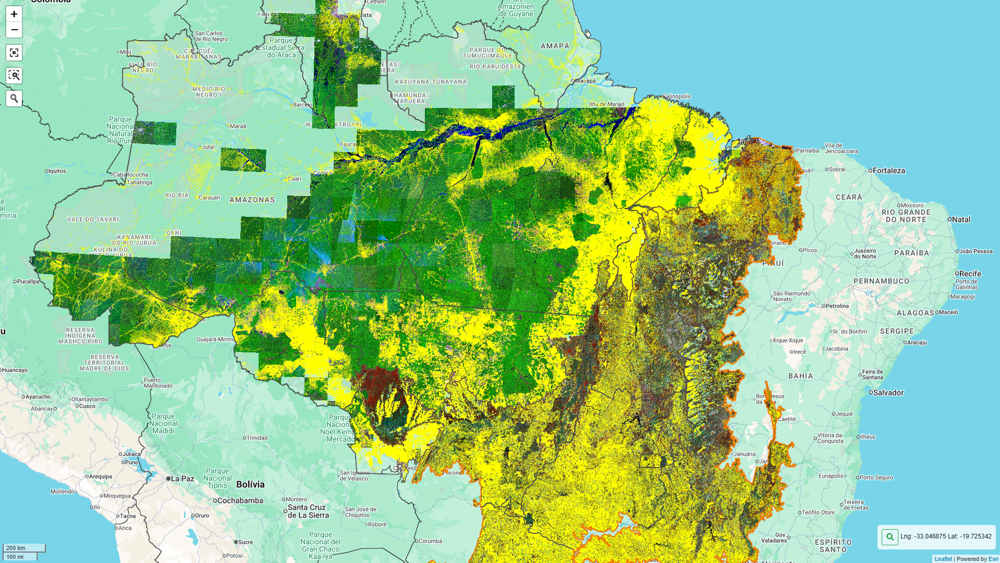

# Projeto de Estudo do Arco do Desmatamento no Pará (1988 - 2004)

# Índice 
* [Descrição do Projeto](#descrição-do-projeto)
* [Status do Projeto](#status-do-Projeto)

# Descrição do Projeto
Projeto de iniciativa particular apoiada pela Embrapa com a finalidade de estudo e aprendizado de Processamento Digital de Imagens, Gerenciamento de Layout para a composição de mapas e outras ferramentas que compõem um SIG para a aplicação no tratamento e ilustração de imagens obtidas através de sensoriamento remoto relacionadas ao Arco do Desmatamento no Pará e em diversos outros projetos e pesquisas científicas internas.
As tecnologias alvo deste estudo são, majoritariamente, a Google Earth Engine API, Python, geemap, folium e QGIS.
### Importante
A imagem a seguir foi extraída do site Terra Brasilis, uma plataforma web desenvolvida pelo INPE para acesso, consulta, análise e disseminação de dados geográficos gerados pelos projetos de monitoramento da vegetação nativa do instituto como o PRODES e o DETER. Esta imagem quantifica e ilustra o Arco do Desmatamento no bioma Amazônico (até 2007) e Cerrado (até 2000) retirados do site mencionado acima. A meta é alcançar resultados semelhantes através do PDI realizado em imagens de sensoriamento remoto do Satelite Landsat 5 e Landsat 7.

# Status do Projeto
> ### 🛠️ Projeto em construção 🛠️

<!-- Título e Imagem de capa;
Badges;
Índice;
Descrição do Projeto;
Status do Projeto;
Funcionalidades e Demonstração da Aplicação;
Acesso ao Projeto;
Tecnologias utilizadas;
Pessoas Contribuidoras;
Pessoas Desenvolvedoras do Projeto;
Licença. -->